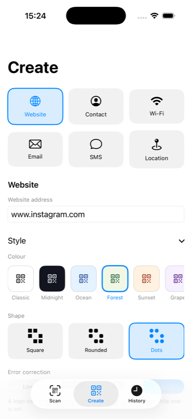
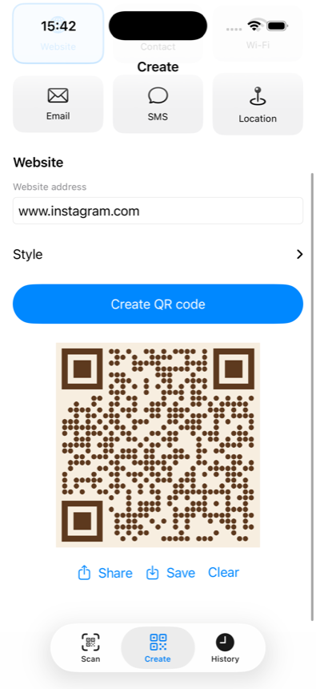
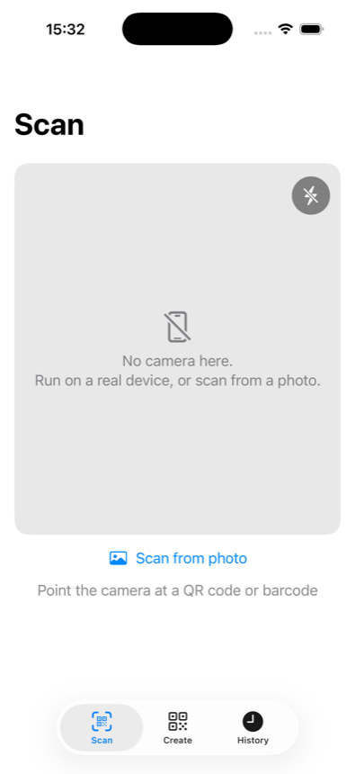
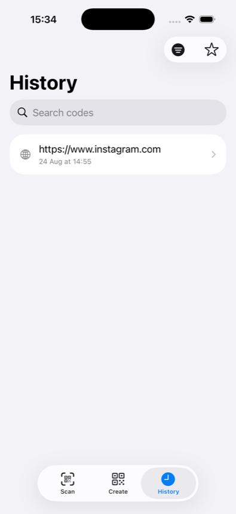

# Kodo

A QR code app for iOS: create styled codes for links, contacts, Wi-Fi and more, and scan QR codes and barcodes with the camera or from a photo.

Written in **pure SwiftUI** — no UIKit anywhere, not even a `UIViewRepresentable` bridge. The camera preview is drawn by SwiftUI itself from raw video frames.

## Screenshots

<div align="center">
<table>
  <tr>
    <td align="center">
      <br>
      <sub><b>Create</b> — pick a type, then style it</sub>
    </td>
    <td align="center">
      <br>
      <sub><b>Styled output</b> — share, save or clear</sub>
    </td>
  </tr>
  <tr>
    <td align="center">
      <br>
      <sub><b>Scan</b> — codes and barcodes, flash, photos</sub>
    </td>
    <td align="center">
      <br>
      <sub><b>History</b> — searchable and filterable</sub>
    </td>
  </tr>
</table>
</div>

The Scan shot is from the Simulator, which has no camera — on a device that grey area is the live preview.

## Features

**Create** — six kinds of code, each with its own form: website, contact (vCard), Wi-Fi, email, SMS and location. Codes render at 1024px or larger, not at screen size, so they stay sharp in print.

- **Styling** — eight ready made colour palettes, three module shapes (square, rounded, dots), a choice of error correction level, and a logo in the middle. Every palette is contrast checked, and a logo automatically forces the highest correction level so the code still scans.
- **Share / Save** — share the code as a real PNG file, or save it to Photos.

**Scan** — the camera reads QR codes *and* barcodes at once (EAN, UPC, Code 39/93/128, ITF, Codabar, Data Matrix, PDF417, Aztec and more); no mode to choose. Includes a flash toggle, tap to focus, a haptic tick on every hit, and scanning from a photo already in your library.

- **It reads the contents, not just the string.** A Wi-Fi code becomes network, password and security; a contact becomes name, phone and email; a location becomes coordinates. Each one offers the matching action: join the network, add to Contacts, call, write an email, open in Maps.
- **Link safety** — before you open a scanned link, Kodo shows the real domain and warns about lookalike (punycode) domains, addresses that hide their destination behind an `@`, URL shorteners, raw IP addresses, unencrypted `http://`, and unusual ports. Flagged links require a confirmation.

**History** — everything you scan or create is stored locally, searchable, filterable by type, and starrable. Tap any entry to see the code again with its details.

## Requirements

- Xcode 26.4
- iOS 26.4 (set in `IPHONEOS_DEPLOYMENT_TARGET`; every API used here exists since iOS 17, so you can lower it if you need older devices)
- A real device for scanning — the Simulator has no camera. Creating codes, history and photo scanning all work in the Simulator.

## Project structure

```
Kodo/
├── KodoApp.swift                    @main + the SwiftData container
├── ContentView.swift                the three tabs
├── Models/
│   ├── CodeRecord.swift             @Model: value, kind, symbology, date, isFavorite
│   ├── QRType.swift                 what you can create, and the form behind it
│   ├── QRStyle.swift                palettes, module shapes, correction levels
│   ├── ScannedContent.swift         what a scanned code turned out to be
│   └── DetectedCode.swift           a hit: value + symbology
├── ViewModels/
│   ├── GeneratorViewModel.swift
│   └── ScannerViewModel.swift
├── Views/
│   ├── GeneratorView.swift
│   ├── ScannerView.swift
│   ├── HistoryView.swift
│   └── CodeDetailView.swift         shared by Scan and History
└── Services/
    ├── QRCodeGenerator.swift        Core Image + Core Graphics: styled codes
    ├── QRPayloadBuilder.swift       text -> vCard / WIFI: / mailto: / geo: ...
    ├── ScannedContentParser.swift   ... and back again
    ├── CameraScanner.swift          AVFoundation: session, torch, focus
    ├── PhotoQRDecoder.swift         Vision: read a code out of an image
    ├── LinkSafety.swift             warns about deceptive links
    ├── WiFiJoiner.swift             joins a scanned network
    └── ContactSaver.swift           saves a scanned contact
```

MVVM, with one rule that keeps it honest:

> **Services** know nothing about SwiftUI. **Views** know nothing about AVFoundation or Core Image. The **ViewModel** is the only translator between them.

That is why `QRCodeGenerator` returns a `CGImage` rather than an `Image` — restyling a screen never touches a service.

## How it works

### Creating a code

The form fields go to `QRPayloadBuilder`, which writes the string format each kind of
code needs — a vCard for a contact, `WIFI:T:WPA;S:...;P:...;;` for a network, `mailto:`
with percent encoded parameters for an email, `geo:` for a location — escaping any
special characters the user typed.

`QRCodeGenerator` then turns that string into an image:

1. `CIFilter.qrCodeGenerator()` produces a tiny `CIImage` — **one pixel per module**.
2. Those pixels are read back into a grid of booleans. That grid *is* the QR code.
3. Core Graphics redraws the grid at full size in the chosen palette and shape.
   The three big corner squares stay solid whatever the shape, because that is what
   a scanner looks for first.
4. A logo, if set, is composited into the middle on a rounded backing plate.

Every created code is inserted into SwiftData (duplicates of the same value are skipped).

### Reading a code

`ScannedContentParser` is the mirror image of the payload builder: it recognises
`WIFI:`, `BEGIN:VCARD`, `mailto:`, `SMSTO:`, `geo:` and plain links, and unescapes the
values back out. That is what lets `CodeDetailView` show fields and offer actions
instead of printing a raw string.

### Scanning

`CameraScanner` runs one `AVCaptureSession` with **two** outputs:

```
                              .-> AVCaptureMetadataOutput  -> "I saw this code, and its type"
back camera -> DeviceInput -> |
                              '-> AVCaptureVideoDataOutput -> one CGImage per frame
```

Normally the preview is an `AVCaptureVideoPreviewLayer` inside a `UIView`. Since this project is SwiftUI-only, each frame is converted to a `CGImage` and handed to the view as an `Image` — so the "live preview" is just an image that changes ~30 times a second.

Because there is no preview layer to convert coordinates, `ScannerViewModel.focus(atTap:in:)` does it by hand: it undoes the `scaledToFill` crop, then rotates the tap into the camera's landscape space.

The camera starts in `.task` and stops in `.onDisappear`, so it never runs in the background.

### Scanning from a photo

`PhotosPicker` gives back image `Data`, which goes to `DetectBarcodesRequest` (Vision).
The result goes through the same code path as a camera scan, so it lands in history too.

### History

`CodeRecord` is a SwiftData `@Model`. Views read it with `@Query(sort: \CodeRecord.createdAt, order: .reverse)`; the view models write to it through a `ModelContext` the view hands them. No manual saving — SwiftData autosaves.

## Permissions

| Key | Why |
| --- | --- |
| `NSCameraUsageDescription` | live scanning |
| `NSPhotoLibraryAddUsageDescription` | saving a created code to Photos |
| `NSContactsUsageDescription` | adding a scanned contact to your address book |

The photo picker needs no permission — it runs out of process.

Joining a scanned Wi-Fi network needs the **Hotspot Configuration** capability, which is
not enabled in this project. Add it under Signing & Capabilities to turn that button on.

Nothing is collected or sent anywhere — see [PRIVACY.md](PRIVACY.md).

## Known gaps

- **No Copy button.** The only clipboard API on iOS is `UIPasteboard`, which is UIKit. Copy is available inside the share sheet instead.
- **No PDF or SVG export** yet, for people printing posters and table tents.
- **No test target.** The payload builder, parser, link checker and generator are pure logic and deserve one.
- **The app icon is still the Xcode placeholder.**

## License

MIT — see [LICENSE](LICENSE).
